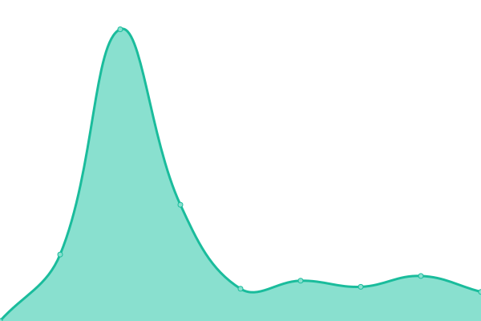

# [📈 Live Status](https://sladerx4.github.io/upptime): <!--live status--> **🟧 Partial outage**

This repository contains the open-source uptime monitor and status page for [sladerx4](https://sladerx4.github.io/upptime), powered by [Upptime](https://github.com/upptime/upptime).

With [Upptime](https://upptime.js.org), you can get your own unlimited and free uptime monitor and status page, powered entirely by a GitHub repository. We use [Issues](https://github.com/sladerx4/upptime/issues) as incident reports, [Actions](https://github.com/sladerx4/upptime/actions) as uptime monitors, and [Pages](https://sladerx4.github.io/upptime) for the status page.

<!--start: status pages-->
<!-- This summary is generated by Upptime (https://github.com/upptime/upptime) -->
<!-- Do not edit this manually, your changes will be overwritten -->
<!-- prettier-ignore -->
| URL | Status | History | Response Time | Uptime |
| --- | ------ | ------- | ------------- | ------ |
|  [Interface](http://interfacenet.com.ar/) | 🟩 Up | [interface.yml](https://github.com/sladerx4/upptime/commits/HEAD/history/interface.yml) | 

 975ms
     
 | 

<a href="https://sladerx4.github.io/upptime/history/interface">100.00%</a>
    

|  [Ctear](http://ctear.com.ar/) | 🟩 Up | [ctear.yml](https://github.com/sladerx4/upptime/commits/HEAD/history/ctear.yml) | 

 8105ms
     
 | 

<a href="https://sladerx4.github.io/upptime/history/ctear">100.00%</a>
    

|  [CobroDigital](https://cobrodigital.com/) | 🟩 Up | [cobro-digital.yml](https://github.com/sladerx4/upptime/commits/HEAD/history/cobro-digital.yml) | 

 955ms
     
 | 

<a href="https://sladerx4.github.io/upptime/history/cobro-digital">100.00%</a>
    

|  [Facebook](https://www.facebook.com/) | 🟩 Up | [facebook.yml](https://github.com/sladerx4/upptime/commits/HEAD/history/facebook.yml) | 

 297ms
     
 | 

<a href="https://sladerx4.github.io/upptime/history/facebook">100.00%</a>
    

|  [Google](https://www.google.com) | 🟩 Up | [google.yml](https://github.com/sladerx4/upptime/commits/HEAD/history/google.yml) | 

 87ms
     
 | 

<a href="https://sladerx4.github.io/upptime/history/google">100.00%</a>
    

|  [Instagram](https://www.instagram.com/) | 🟩 Up | [instagram.yml](https://github.com/sladerx4/upptime/commits/HEAD/history/instagram.yml) | 

 720ms
     
 | 

<a href="https://sladerx4.github.io/upptime/history/instagram">100.00%</a>
    

|  [Steam](https://store.steampowered.com/) | 🟥 Down | [steam.yml](https://github.com/sladerx4/upptime/commits/HEAD/history/steam.yml) | 

 471ms
     
 | 

<a href="https://sladerx4.github.io/upptime/history/steam">100.00%</a>
    

|  [PCCP](https://pccp.ar/) | 🟩 Up | [pccp.yml](https://github.com/sladerx4/upptime/commits/HEAD/history/pccp.yml) | 

 1106ms
     
 | 

<a href="https://sladerx4.github.io/upptime/history/pccp">99.54%</a>
    

<!--end: status pages-->

[**Visit our status website →**](https://sladerx4.github.io/upptime)

## 📄 License

- Powered by: [Upptime](https://github.com/upptime/upptime)
- Code: [MIT](./LICENSE) © [sladerx4](https://sladerx4.github.io/upptime)
- Data in the `./history` directory: [Open Database License](https://opendatacommons.org/licenses/odbl/1-0/)
